<div align="center">


<br/>

<a href="https://github.com/melanievicente">
  
</a>
&nbsp;
<a href="https://github.com/melanievicente?tab=repositories">
  
</a>
&nbsp;
<a href="https://github.com/melanievicente?tab=followers">
  
</a>

</div>

<br/>

<div align="center">
  
</div>

<br/>


<br/>

## &gt; whoami

<table border="0" cellspacing="0" cellpadding="10" style="border:none;">
<tr>
<td width="40%" valign="top" style="border:none;">

```yaml
name: Melanie Vicente
role: Estudiante de Computacion Cientifica
focus:
  - Data Analysis
  - Machine Learning
  - Software Engineering
status: Decimo superior
mindset: "Build. Break. Learn. Repeat."
```

</td>
<td width="35%" valign="top" style="border:none;">

### 🚀 Enfoque actual

- 📊 Analisis y visualizacion de datos
- 🤖 Modelos de Machine Learning
- 🧠 Explorando ciencia de datos aplicada
- 💻 Buenas practicas de ingenieria de software
- ☕ Impulsada por cafe y curiosidad

</td>
<td width="25%" valign="top" align="center" style="border:none;">


</td>
</tr>
</table>

<br/>


<br/>

## &gt; github_analytics --deep-scan

<table border="0" cellspacing="10" cellpadding="0" width="100%">
<tr>
<td width="50%" valign="top" align="center">


</td>
<td width="50%" valign="top" align="center">


</td>
</tr>
<tr>
<td width="50%" valign="top" align="center">


</td>
<td width="50%" valign="top" align="center">


</td>
</tr>
<tr>
<td colspan="2" align="center">


</td>
</tr>
<tr>
<td colspan="2" align="center">


</td>
</tr>
</table>

<br/>


<br/>

## &gt; arcade --play

<div align="center">
  
  <!-- Pac-Man Contribution Graph -->
  <picture>
    <source media="(prefers-color-scheme: dark)" srcset="./imagenes/pacman-contribution-graph-dark.svg"/>
    <source media="(prefers-color-scheme: light)" srcset="./imagenes/pacman-contribution-graph.svg"/>
    
  </picture>
  
  <br/>
  
  <sub>👾 Watch Pac-Man devour my contributions!</sub>
  
</div>

<br/>


<br/>

## &gt; tech_stack --list

<div align="center">

<h4>🐍 Data Science & ML</h4>
<p>
  
</p>

<h4>💻 Lenguajes</h4>
<p>
  
</p>

<h4>🌐 Desarrollo Web</h4>
<p>
  
</p>

<h4>🗄️ Bases de datos</h4>
<p>
  
</p>

<h4>🔧 Herramientas</h4>
<p>
  
</p>

</div>

<br/>


<br/>

## &gt; connect --social

<div align="center">

<a href="https://www.linkedin.com/in/melanie-vicente-fajardo" target="_blank">
  
</a>
&nbsp;
<a href="mailto:melanievicente070104@gmail.com">
  
</a>

<picture>
  <source media="(prefers-color-scheme: dark)" srcset="./imagenes/breakout-contribution-graph-dark.svg">
  <source media="(prefers-color-scheme: light)" srcset="./imagenes/breakout-contribution-graph.svg">
  
</picture>

</div>

<br/>

## &gt; dev_quote --random

<div align="center"> 
   
</div> 

<br/>

<div align="center">
  
</div>
